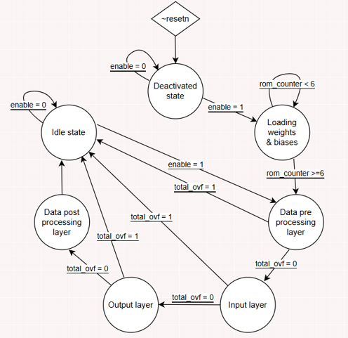

# Verilog Neural Processing System

Verilog RTL implementation of a neural processing system featuring a 7-state Moore FSM, MAC datapath, ROM-based weights/biases and testbench verification.

**Course:** Low Level Hardware Digital Systems I
**Year:** 2025-2026

## Project Overview

The design was developed incrementally through several hardware modules:

-Arithmetic Logic Unit (ALU)
-Calculator
-Encoded calculator
-Register file
-Multiply-Accumulate (MAC) unit
-Neural-processing system

The final system combines the previously developed components into a sequential datapath controlled by a Moore FSM.

## Architecture

The neural-processing module includes:

- A 7-state Moore FSM for operation sequencing
- Multiply-Accumulate (MAC) operations
- Register-based intermediate storage
- ROM-based weights and bias values
- Sequential processing of input data

## FSM

## Verification

The design was verified using simulation and dedicated testbenches.

Testing included multiple input ranges and comparison with a reference model.

**Final verification result : 300/300 tests passed**
